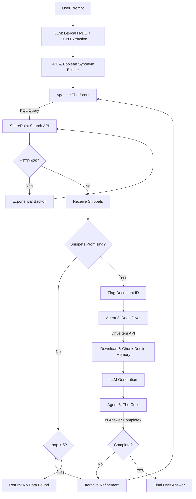

# Agentic Federated Lexical RAG (AFL-RAG)
**An End-to-End Implementation Guide for Hybrid-less Lexical Retrieval**

---

## 1. Introduction & Problem Statement
In modern enterprise AI, the standard Retrieval-Augmented Generation (RAG) architecture relies heavily on Vector Databases (Azure AI Search, Pinecone, Milvus). While highly effective for semantic search, scaling Vector RAG to the enterprise level introduces severe bottlenecks:
1. **Exorbitant Costs:** Storing and computing vector embeddings for millions of enterprise documents is exceptionally expensive.
2. **Data Duplication & Sync Lag:** A continuous "Pull-Chunk-Embed-Sync" pipeline must be maintained to copy data from the source of truth (e.g., SharePoint) into the Vector DB. This results in stale data and massive pipeline maintenance.
3. **Security Trimming (ACLs):** Replicating complex, hierarchical enterprise permissions (Access Control Lists) into a flat Vector DB is notoriously difficult, often resulting in security risks.

### The Solution: Agentic Federated Lexical RAG (AFL-RAG)
This guide outlines the implementation of an **AFL-RAG solution** that completely bypasses the Vector Database. By combining **Multi-Agent Orchestration** with advanced **Lexical Search (SharePoint / Microsoft Graph APIs)**, we can mimic the behavior of a highly skilled human researcher. 

This architecture guarantees 100% data freshness, zero data duplication, native security compliance (since the API is queried on behalf of the user), and significantly higher accuracy than naive Vector RAG.

---

## 2. Core Architectural Workflow

At the heart of this solution is a Multi-Agent system that executes a "Double-Tap" retrieval strategy. Rather than pulling massive amounts of data blindly, the agents operate in a highly specific, iterative loop.

---

## 3. Step-by-Step Implementation Guide

To build this system, you must implement specific techniques to overcome the inherent weaknesses of traditional lexical (keyword) search.

### Step 1: Lexical HyDE (Hypothetical Document Expansion)
**The Problem:** Lexical search suffers from the "Vocabulary Gap." If the user searches for "car", but the document says "automobile," lexical search fails.
**The Implementation:**
Before you extract keywords from the user's prompt, pass the prompt to a fast, cheap LLM (like GPT-3.5 or Gemini Flash) with the following instruction:
* *"Write a fake, highly detailed answer to this question. Assume you know the facts, even if you hallucinate them. Use professional, domain-specific terminology."*

**The Keyword Extraction:** You should **absolutely use the LLM** to extract the keywords from this fake answer, rather than relying on a basic, static NLP algorithm (like TF-IDF or spaCy). A basic algorithm lacks reasoning and might extract irrelevant nouns. The LLM can logically deduce which terms are the highest-value search targets.

> [!TIP]
> **Optimization (The Single Prompt):** To save latency and API costs, you do not need two separate LLM calls (one to write the answer, one to extract). Ask the LLM to do both simultaneously using Structured Output (JSON). 
> *Prompt Addition: "...After writing the fake answer, analyze your own text and output a JSON array containing the top 10 most critical, domain-specific search keywords and synonyms you used."* This guarantees you bridge the vocabulary gap efficiently.

### Step 2: Native Metadata Injection (KQL Mastery)
**The Problem:** Vector databases are terrible at structured filtering (e.g., "Find documents by John from last year").
**The Implementation:**
SharePoint's Keyword Query Language (KQL) handles metadata natively. Have your LLM analyze the user prompt and extract hard constraints. Convert these directly into KQL.
* **User Prompt:** "What did John Daniel do on the EV project recently?"
* **Generated KQL:** `("EV" OR "Electric" OR "Battery") AND Author:"John Daniel" AND LastModifiedTime>2023-01-01`
This step acts as a massive pre-filter, guaranteeing that the search engine only searches the exact slice of the repository the user cares about.

### Step 3: Throttling Mitigation via Synonym Maps
**The Problem:** If an agent rapidly fires 50 individual keyword searches at the Microsoft Graph API, it will trigger an `HTTP 429 Too Many Requests` throttling error.
**The Implementation:**
Bundle your extracted keywords, HyDE vocabulary, and KQL metadata into a single, massive Boolean string (using `OR` and `AND` operators). 

> [!CAUTION]
> **Query Length Limits:** SharePoint KQL has a programmatic character limit of **4,096 characters**. Your prompt must instruct the LLM to prioritize the *most valuable* synonyms rather than an exhaustive dictionary list to ensure the query fits within this limit.

By passing this dense query, you drastically reduce API calls. We recommend a maximum limit of **5 API calls per user prompt**. 

> [!TIP]
> **Enterprise Concurrency & Exponential Backoff:** Even with a 5-call limit, if 100 out of 5,000 enterprise users prompt the system at the exact same second, you will generate 500 rapid API calls. Microsoft Graph employs multi-layered throttling and will eventually return an `HTTP 429 Too Many Requests` error. Your architecture must implement **Exponential Backoff**. If the Agent receives a 429, it should wait for the duration specified in the Graph API's `Retry-After` header before executing the next iteration.

---

## 4. The Multi-Agent Engine (Execution)

The system requires three distinct agents to execute the research, mimicking human behavior.

### Agent 1: The Scout (Iterative Refinement)
The Scout is responsible for interacting with the SharePoint Search API. 
1. **Execution:** It fires the dense KQL query. SharePoint returns a list of matching documents, but it only returns short snippets (`HitHighlightedSummary`).
2. **Assessment:** The Scout reads these 100-character snippets. 
3. **Iterative Refinement (The Human Loop):** Humans rarely find the right document on try #1. If the Scout reads the snippets and realizes none of them actually answer the question, it uses its reasoning engine to say: *"Ah, 'EV' didn't work. Let me refine the KQL to search for specific battery chemistry terms instead."* It re-queries (up to a safe limit of **5 times**).
4. **Handoff:** When it finds a promising snippet, it flags the specific Document ID and hands it to Agent 2.

> [!WARNING]
> **The Context Window vs. Snippets Problem:** You cannot rely solely on the `HitHighlightedSummary` for generation. The API dynamically generates these snippets, and they are usually too short (often lacking the surrounding technical context) for an LLM to generate a high-quality answer. This is why Agent 2 is strictly required.

### Agent 2: The Deep Diver ("Double-Tap" Strategy)
Agent 2 solves the Context Window problem. Instead of blindly downloading 10 massive PDFs (which would blow out token limits and cost a fortune), Agent 2 only downloads the *one* specific document flagged by the Scout.
1. **Execution:** Agent 2 uses the **Microsoft Graph DriveItem API** (not the Search API) to fetch/download the specific file.
2. **In-Memory Processing:** It chunks the document in memory, identifies the paragraphs surrounding the original hit, and generates the draft answer based on this deep, rich context.

### Agent 3: The Critic ("Missing Puzzle Piece")
Sometimes a document only answers *half* of the user's question.
1. **Execution:** After Agent 2 drafts an answer, Agent 3 (The Critic) evaluates the draft against the original user prompt.
2. **The Feedback Loop:** If the prompt asked for "EV work AND Pricing," but the document only detailed the engineering work, Agent 3 pauses the final output.
3. **Redeployment:** It sends Agent 1 back out with a highly specific new mission: *"We have the engineering details. Now go find pricing models related to the EV battery."*

---

## 5. System Advantages (Vector vs. AFL-RAG)

By implementing this architecture, you achieve significant performance gains over a standard Vector DB RAG:

| Feature | Standard Vector RAG | Agentic Federated Lexical RAG |
| :--- | :--- | :--- |
| **Data Storage Cost** | High (Requires dedicated DB) | **Zero** (Uses existing SharePoint) |
| **Data Freshness** | Stale (Requires sync pipelines) | **Live** (Queries source of truth) |
| **Security / ACLs** | Complex/Risky to replicate | **Native** (Runs under User's Graph Token) |
| **Metadata Filtering** | Poor (Often ignores dates/authors) | **Excellent** (Native KQL support) |
| **Accuracy** | Good (Mathematical proximity) | **Superior** (Agentic reasoning & critique) |
| **Latency** | Low (~1-3 seconds) | High (~5-15 seconds due to agent loop) |

---

## 6. Technical Reference: Required Graph APIs
For developers implementing this, the following Microsoft Graph endpoints are critical:

1. **The Scout Search API:**
   `POST https://graph.microsoft.com/v1.0/search/query`
   *Use this to pass your dense KQL query. Request `HitHighlightedSummary` in the fields.*
2. **The Deep Dive Document API (DriveItem):**
   `GET https://graph.microsoft.com/v1.0/sites/{site-id}/drive/items/{item-id}/content`
   *Use this to download the raw file for Agent 2 to chunk in-memory. You can also append `?format=pdf` for automatic conversion of office docs.*

## Conclusion
This Agentic Federated Lexical RAG (AFL-RAG) architecture is a paradigm shift in enterprise AI. By trading latency for intelligence, you eliminate the massive infrastructure costs of vector databases. Through the strategic use of Lexical HyDE, KQL Metadata Injection, and a Multi-Agent "Double-Tap" framework, the system mimics the precision of a human researcher, resulting in an architecture that is more secure, cheaper to operate, and significantly more accurate.
